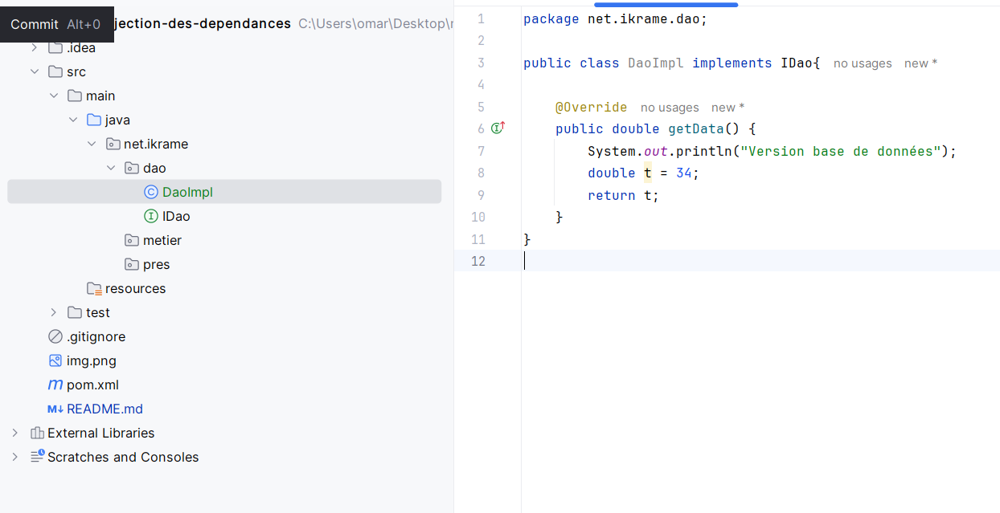

# **Activité Pratique N°1 - Injection des dépendances**

## **Partie 1 :**

1. Créer l'interface IDao avec une méthode getData

2. Créer une implémentation de cette interface

3. Créer l'interface IMetier avec une méthode calcul

4. Créer une implémentation de cette interface en utilisant le couplage faible

5. Faire l'injection des dépendances :
   a. Par instanciation statique
   
   b. Par instanciation dynamique
   c. En utilisant le Framework Spring
   - Version XML
   - Version annotations
